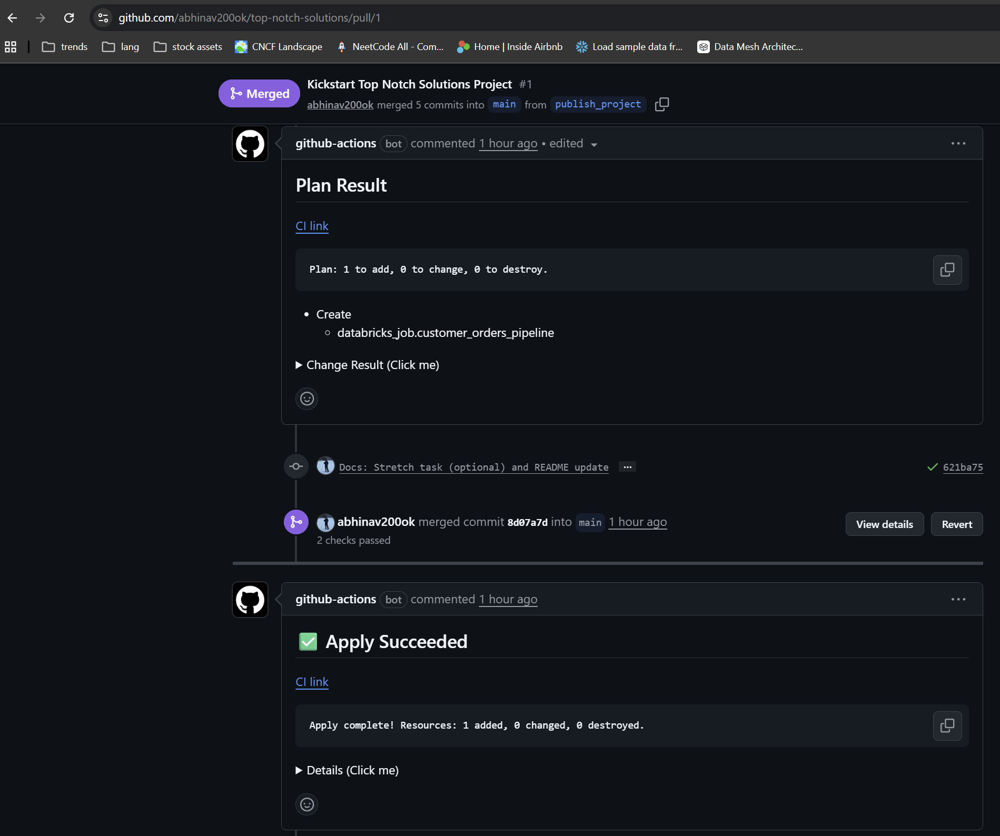
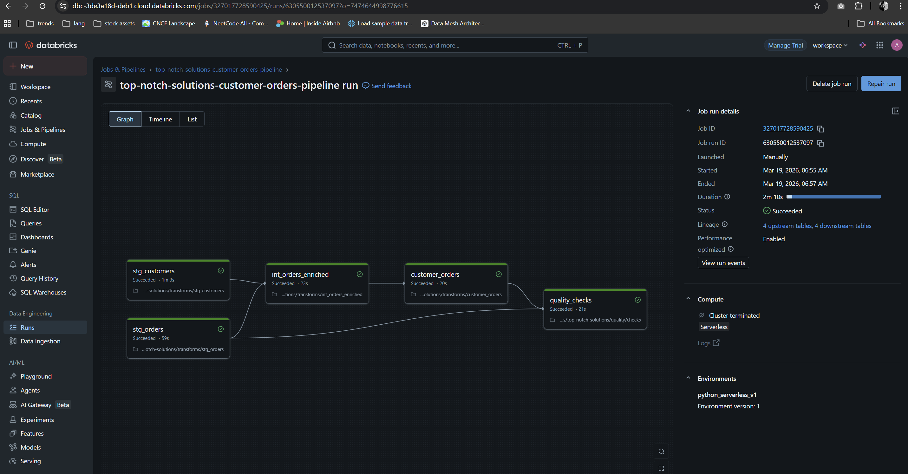
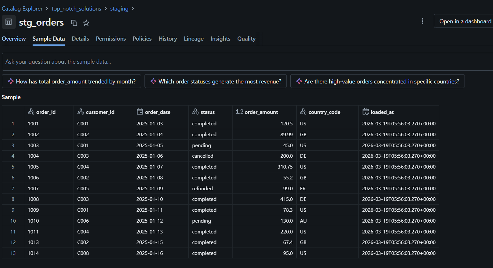
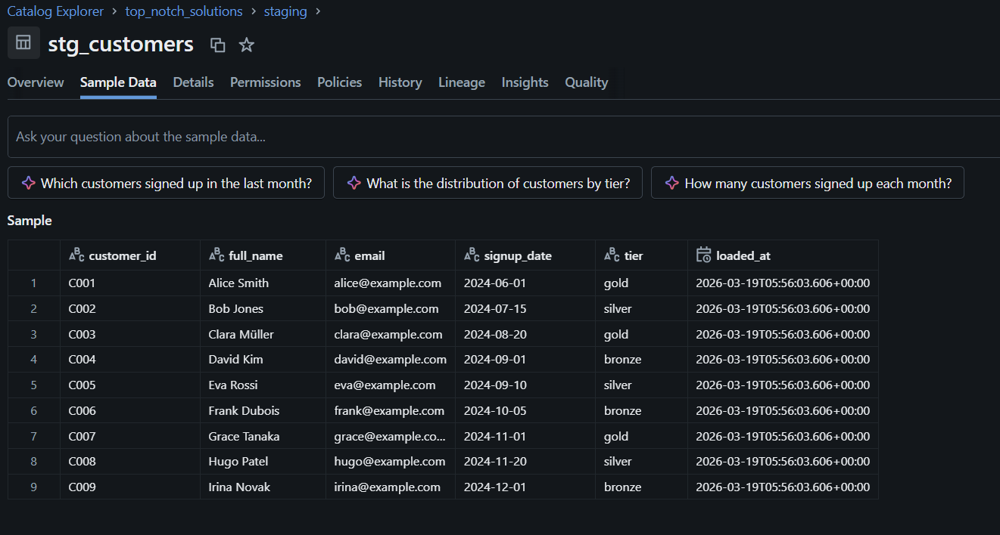
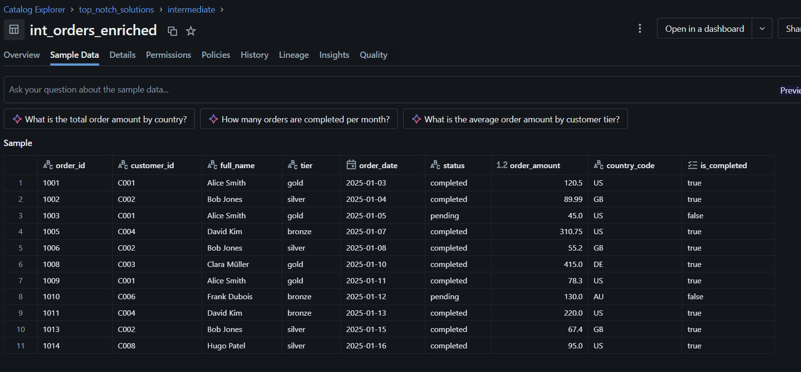
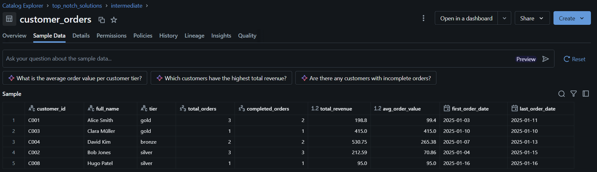
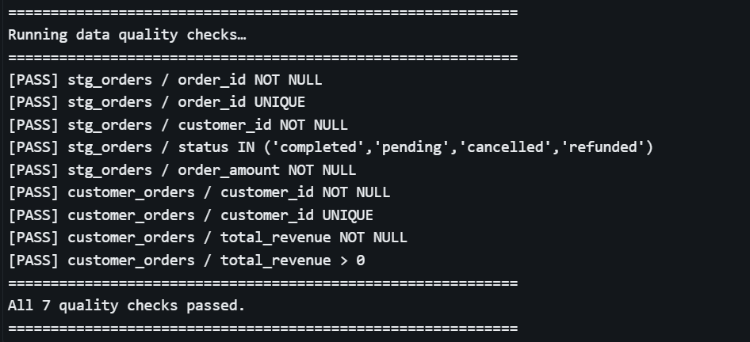
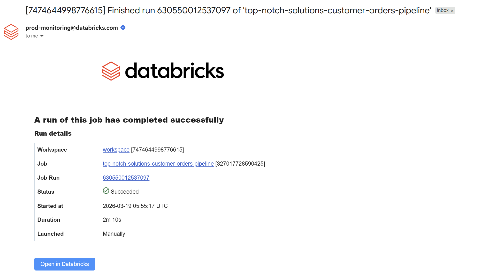

# Screenshots for Quick Reference

## Job Deployment

Shows the Terraform deployment output used to create the Databricks job.

---

## Job Run DAG

Shows the task dependency graph for the Databricks job execution flow.

---

## Staging Orders

Shows the staged orders output after cleaning and standardization.

---

## Staging Customers

Shows the staged customers output with the combined full name field.

---

## Enriched Orders

Shows the joined orders dataset after customer attributes are added.

---

## Customer Summary

Shows the final customer-level summary table built from enriched orders.

---

## Quality Checks

Shows the validation output confirming the pipeline checks passed.

---

## Success Notification

Shows the success email sent after the pipeline completed successfully.

