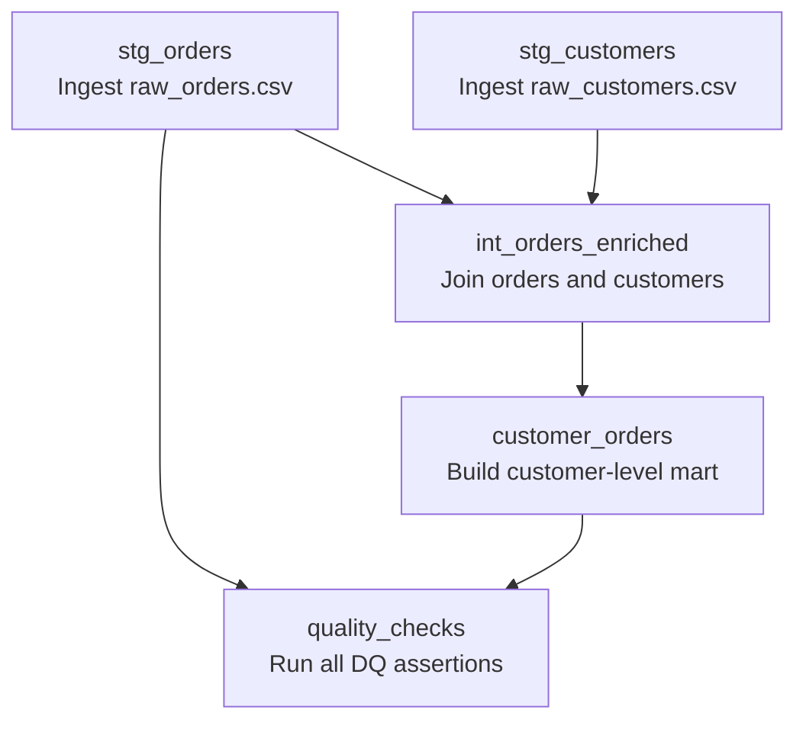

# Orchestration

This directory contains the Terraform configuration for the Databricks job infrastructure used by this repository. HCP Terraform stores state remotely and provides locking.

## Job DAG

The Databricks job defined in `customer_orders_pipeline.tf` runs the following task graph:

## Execution Summary

- `stg_orders` and `stg_customers` start in parallel.
- `int_orders_enriched` waits for both staging tasks.
- `customer_orders` waits for `int_orders_enriched`.
- `quality_checks` waits for both `stg_orders` and `customer_orders`.
